<picture>
  <source media="(prefers-color-scheme: dark)" srcset="assets/not-reed-banner.svg">
  
</picture>

---

**running**

[sprawl](https://github.com/not-reed/sprawl) · [docs](https://sprawl.pages.dev)
ai monorepo. daemons that watch, agents that remember, a Telegram bot that rewrites itself at 3am. market intel. paper trading. RPG GM. Rust TUI. documented for me, not for you.

tinted · [tinted.fun](https://tinted.fun)
onchain color NFTs. palette management. pixel art. Foundry + Bun.

---

**in the wild**

[idle-perps](https://idle-perps.vercel.app) · [rattlejack](https://rattlejack.vercel.app) · [lazer-2048](https://lazer-2048.vercel.app)
onchain games on Farcaster/Base. built at [Lazer](https://lazertechnologies.com). repos private.

---

**buried:** degen.watch · HappyChain · mintingti.me · talktalia · viem-playground

---

by day: engineer @ [Lazer Technologies](https://lazertechnologies.com)
by night: this

---

`ts` `viem` `wagmi` `foundry` `hono` `rust` `sqlite` `pnpm`
